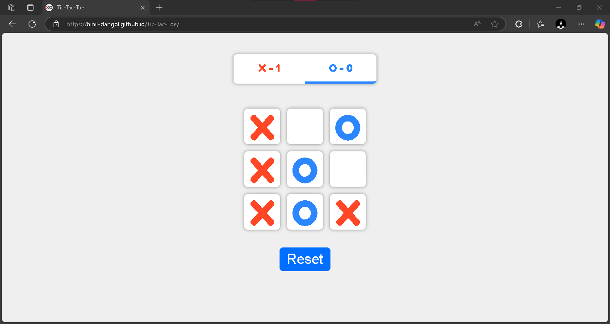
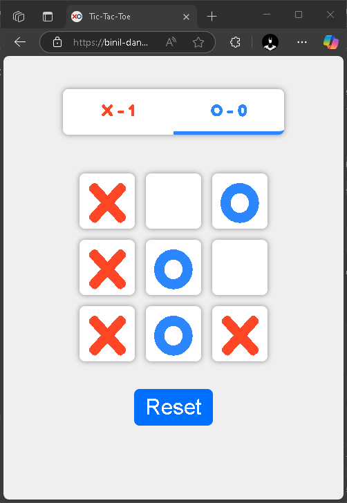

# Tic Tac Toe

A simple Tic Tac Toe game built with React.js and Vite. Test your skills against a friend in this classic 3×3 grid game.  
➡️ Live demo: [https://binil-dangol.github.io/Tic-Tac-Toe/](https://binil-dangol.github.io/Tic-Tac-Toe/)

---

## Table of Contents

- [Features](#features)  
- [Demo](#demo)  
- [Getting Started](#getting-started)   
- [Deployment](#deployment)  
- [Technologies Used](#technologies-used)  
- [License](#license)  

---

## Features

- 🎮 **Two-player mode** – Players take turns placing “X” and “O”.  
- 🏆 **Win detection** – Automatically detects and announces when someone wins.  
- 📊 **Scoreboard** – Tracks and displays each player’s win count.  
- 🔄 **Reset** – Reset the board or the entire score at any time.  
- ⚡ **Fast dev experience** – Powered by Vite’s lightning-fast hot reload.  

---

## Demo

  
*Figure 1: Screenshot-1*  

  
*Figure 2: Screenshot-2.*  

Check it out live: [https://binil-dangol.github.io/Tic-Tac-Toe/](https://binil-dangol.github.io/Tic-Tac-Toe/)

---

## Getting Started

1. **Prerequisites:** Node.js v14+ and npm v6+ (or Yarn)  
2. **Clone, install dependencies, and start the dev server:**
   ```bash
   git clone https://github.com/binil-dangol/Tic-Tac-Toe.git
   cd Tic-Tac-Toe
   npm install
   npm run dev
   
## Setup & Details

3. Open your browser at `http://localhost:5173` (or the URL shown in the console).

In the project directory, you can run:

| Command           | Description                                           |
| ----------------- | ----------------------------------------------------- |
| `npm run dev`     | Start Vite development server (hot-reload enabled)    |
| `npm run build`   | Create a production build in the `dist/` folder       |
| `npm run preview` | Preview the production build locally                  |
| `npm run lint`    | Run ESLint on all `.js/.jsx` files                    |
| `npm run deploy`  | Build & deploy to GitHub Pages (`gh-pages` branch)    |

## Deployment: 
This app is set up for GitHub Pages. The `homepage` field in `package.json` is set to your Pages URL:
```json
"homepage": "https://binil-dangol.github.io/Tic-Tac-Toe/"
```

## Technologies Used
 - **React v19**
  
 - **Vite v4+**
  
 - **GitHub Pages for hosting**
  
 - **ESLint for linting**
  
 - **Plain CSS**

## License
This project is open source and available under the MIT License.
